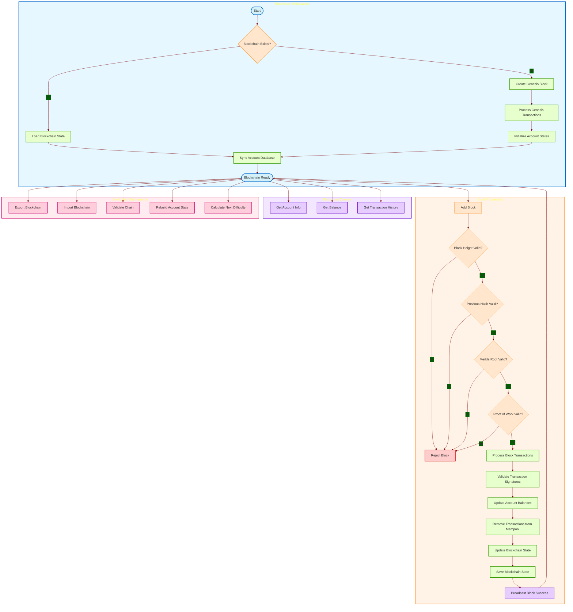
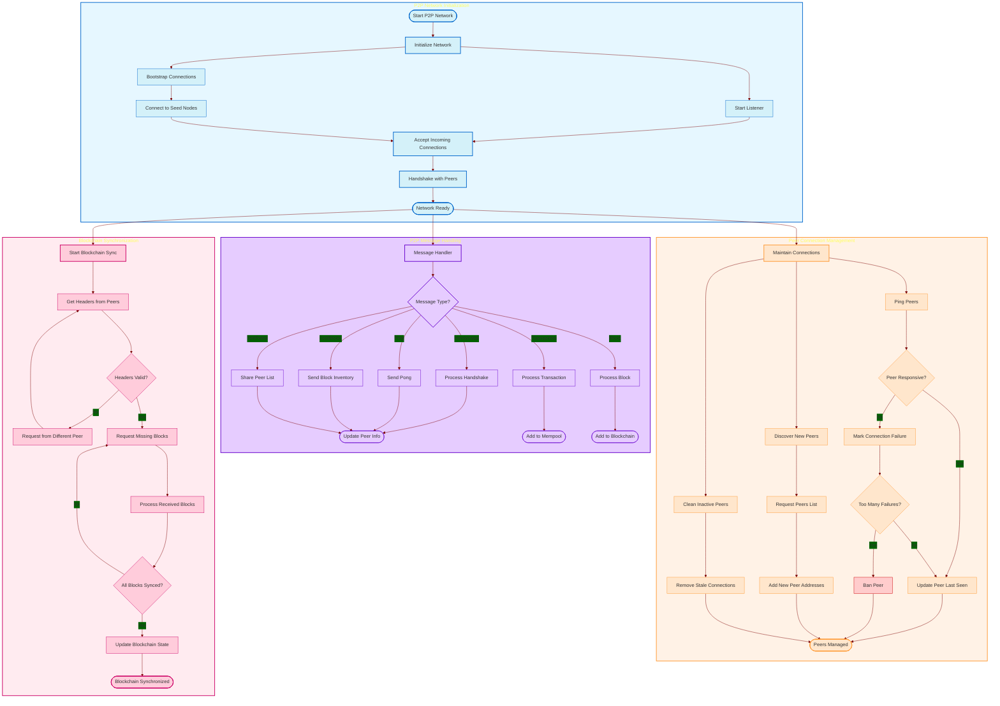
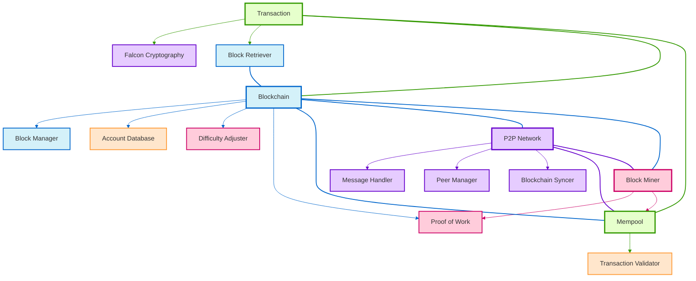

# Qbitcoin Blockchain Flowchart

## Core Blockchain Flow

## Transaction Processing Flow

```mermaid
%%{init: { 'theme': 'base', 'themeVariables': { 'primaryColor': '#f0f0f0', 'primaryTextColor': '#323232', 'primaryBorderColor': '#7C0000', 'lineColor': '#7C0000', 'secondaryColor': '#006100', 'tertiaryColor': '#0000A0' } } }%%
flowchart TD
    %% Transaction creation and validation
    subgraph tx_creation [" Transaction Creation "]
        style tx_creation fill:#e6f7ff,stroke:#0066cc,stroke-width:2px
        A1([Start Transaction]) --> A2[Create Transaction]
        style A1 fill:#d4f1f9,stroke:#0066cc,stroke-width:2px
        style A2 fill:#d4f1f9,stroke:#0066cc,stroke-width:2px
        
        A2 --> A3{Transaction Type?}
        style A3 fill:#ffe6cc,stroke:#ff9933,stroke-width:2px
        
        A3 -- Standard --> A4[Create Transaction with Inputs/Outputs]
        A3 -- Coinbase --> A5[Create Coinbase Transaction]
        style A4 fill:#d4f1f9,stroke:#0066cc,stroke-width:1px
        style A5 fill:#d4f1f9,stroke:#0066cc,stroke-width:1px
        
        A4 --> A6[Calculate Transaction Hash]
        A5 --> A6
        style A6 fill:#d4f1f9,stroke:#0066cc,stroke-width:2px
        
        A6 --> A7[Sign Transaction with Falcon]
        style A7 fill:#d4f1f9,stroke:#0066cc,stroke-width:2px
        
        A7 --> A8([Transaction Ready])
        style A8 fill:#d4f1f9,stroke:#0066cc,stroke-width:2px
    end
    
    %% Transaction validation
    subgraph tx_validation [" Transaction Validation "]
        style tx_validation fill:#fff2e6,stroke:#ff9933,stroke-width:2px
        A8 --> B1[Validate Transaction]
        style B1 fill:#ffe6cc,stroke:#ff9933,stroke-width:2px
        
        B1 --> B2{Size Valid?}
        style B2 fill:#ffe6cc,stroke:#ff9933,stroke-width:1px
        
        B2 -- No --> B9[Reject Transaction]
        B2 -- Yes --> B3{Timestamp Valid?}
        style B9 fill:#ffcccc,stroke:#cc0000,stroke-width:2px
        style B3 fill:#ffe6cc,stroke:#ff9933,stroke-width:1px
        
        B3 -- No --> B9
        B3 -- Yes --> B4{Signature Valid?}
        style B4 fill:#ffe6cc,stroke:#ff9933,stroke-width:1px
        
        B4 -- No --> B9
        B4 -- Yes --> B5{Inputs Valid?}
        style B5 fill:#ffe6cc,stroke:#ff9933,stroke-width:1px
        
        B5 -- No --> B9
        B5 -- Yes --> B6{Balance Sufficient?}
        style B6 fill:#ffe6cc,stroke:#ff9933,stroke-width:1px
        
        B6 -- No --> B9
        B6 -- Yes --> B7[Add to Mempool]
        style B7 fill:#e6ffcc,stroke:#339900,stroke-width:2px
        
        B7 --> B8([Transaction Accepted])
        style B8 fill:#e6ffcc,stroke:#339900,stroke-width:2px
    end
    
    %% Public Key Retrieval Flow
    subgraph pubkey_retrieval [" Public Key Retrieval "]
        style pubkey_retrieval fill:#e6f7ff,stroke:#0066cc,stroke-width:2px
        B4 -- Needs Key --> PK1[Get Transaction Input References]
        style PK1 fill:#d4f1f9,stroke:#0066cc,stroke-width:1px
        
        PK1 --> PK2[Find Block with Original Transaction]
        style PK2 fill:#d4f1f9,stroke:#0066cc,stroke-width:1px
        
        PK2 --> PK3[Extract Public Key from Block]
        style PK3 fill:#d4f1f9,stroke:#0066cc,stroke-width:1px
        
        PK3 --> PK4[Verify Signature with Retrieved Key]
        style PK4 fill:#d4f1f9,stroke:#0066cc,stroke-width:1px
        
        PK4 --> B4
    end
    
    %% Mempool management
    subgraph mempool_mgmt [" Mempool Management "]
        style mempool_mgmt fill:#e6ffcc,stroke:#339900,stroke-width:2px
        B8 --> C1[Add to Mempool]
        style C1 fill:#e6ffcc,stroke:#339900,stroke-width:2px
        
        C1 --> C2{Mempool Full?}
        style C2 fill:#ffe6cc,stroke:#ff9933,stroke-width:1px
        
        C2 -- Yes --> C3[Evict Low-Fee Transactions]
        C2 -- No --> C4[Update Address Index]
        style C3 fill:#e6ffcc,stroke:#339900,stroke-width:1px
        style C4 fill:#e6ffcc,stroke:#339900,stroke-width:1px
        
        C3 --> C4
        C4 --> C5[Update Tx Metadata]
        style C5 fill:#e6ffcc,stroke:#339900,stroke-width:1px
        
        C5 --> C6[Save Mempool State]
        style C6 fill:#e6ffcc,stroke:#339900,stroke-width:1px
        
        C6 --> C7[Broadcast Transaction]
        style C7 fill:#e6ccff,stroke:#6600cc,stroke-width:2px
        
        C7 --> C8([Ready for Mining])
        style C8 fill:#e6ffcc,stroke:#339900,stroke-width:2px
        
        %% Link to mining
        C8 -.-> PM1
    end
```

## P2P Network Flow

## Data Storage Flow

```mermaid
%%{init: { 'theme': 'base', 'themeVariables': { 'primaryColor': '#f0f0f0', 'primaryTextColor': '#323232', 'primaryBorderColor': '#7C0000', 'lineColor': '#7C0000', 'secondaryColor': '#006100', 'tertiaryColor': '#0000A0' } } }%%
flowchart TD
    %% Chain Manager Storage
    subgraph chain_storage [" Chain Manager Storage "]
        style chain_storage fill:#e6f7ff,stroke:#0066cc,stroke-width:2px
        CM1([Store Block]) --> CM2{File Size Check}
        style CM1 fill:#d4f1f9,stroke:#0066cc,stroke-width:2px
        style CM2 fill:#d4f1f9,stroke:#0066cc,stroke-width:1px
        
        CM2 -- Full --> CM3[Create New Block File]
        CM2 -- Space Available --> CM4[Open Current File]
        style CM3 fill:#d4f1f9,stroke:#0066cc,stroke-width:1px
        style CM4 fill:#d4f1f9,stroke:#0066cc,stroke-width:1px
        
        CM3 --> CM5[Serialize Block]
        CM4 --> CM5
        style CM5 fill:#d4f1f9,stroke:#0066cc,stroke-width:2px
        
        CM5 --> CM6[Write Magic Bytes]
        CM6 --> CM7[Write Block Size]
        CM7 --> CM8[Write Block Data]
        style CM6 fill:#d4f1f9,stroke:#0066cc,stroke-width:1px
        style CM7 fill:#d4f1f9,stroke:#0066cc,stroke-width:1px
        style CM8 fill:#d4f1f9,stroke:#0066cc,stroke-width:1px
        
        CM8 --> CM9[Update Block Index]
        style CM9 fill:#d4f1f9,stroke:#0066cc,stroke-width:2px
        
        CM9 --> CM10[Save Block Index]
        style CM10 fill:#d4f1f9,stroke:#0066cc,stroke-width:2px
    end
    
    %% Account Database
    subgraph account_db [" Account Database "]
        style account_db fill:#fff2e6,stroke:#ff9933,stroke-width:2px
        AD1([Update Account]) --> AD2[Get Account]
        style AD1 fill:#ffe6cc,stroke:#ff9933,stroke-width:2px
        style AD2 fill:#ffe6cc,stroke:#ff9933,stroke-width:1px
        
        AD2 --> AD3{Account Exists?}
        style AD3 fill:#ffe6cc,stroke:#ff9933,stroke-width:1px
        
        AD3 -- Yes --> AD4[Update Balance]
        AD3 -- No --> AD5[Create Account]
        style AD4 fill:#ffe6cc,stroke:#ff9933,stroke-width:1px
        style AD5 fill:#ffe6cc,stroke:#ff9933,stroke-width:1px
        
        AD4 --> AD6[Update Transaction History]
        AD5 --> AD6
        style AD6 fill:#ffe6cc,stroke:#ff9933,stroke-width:1px
        
        AD6 --> AD7[Store Block Reference for Public Key]
        style AD7 fill:#ffe6cc,stroke:#ff9933,stroke-width:1px
        
        AD7 --> AD8[Save Account Data]
        style AD8 fill:#ffe6cc,stroke:#ff9933,stroke-width:2px
    end
    
    %% Mempool Storage
    subgraph mempool_storage [" Mempool Storage "]
        style mempool_storage fill:#e6ffcc,stroke:#339900,stroke-width:2px
        MP1([Save Mempool]) --> MP2[Serialize Transactions]
        style MP1 fill:#e6ffcc,stroke:#339900,stroke-width:2px
        style MP2 fill:#e6ffcc,stroke:#339900,stroke-width:1px
        
        MP2 --> MP3[Create Temp File]
        style MP3 fill:#e6ffcc,stroke:#339900,stroke-width:1px
        
        MP3 --> MP4[Write Transaction Data]
        style MP4 fill:#e6ffcc,stroke:#339900,stroke-width:1px
        
        MP4 --> MP5[Move to Mempool File]
        style MP5 fill:#e6ffcc,stroke:#339900,stroke-width:2px
    end
```

## Cryptocurrency System Components

## Mining and Consensus Flow

```mermaid
%%{init: { 'theme': 'base', 'themeVariables': { 'primaryColor': '#f0f0f0', 'primaryTextColor': '#323232', 'primaryBorderColor': '#7C0000', 'lineColor': '#7C0000', 'secondaryColor': '#006100', 'tertiaryColor': '#0000A0' } } }%%
flowchart TD
    %% Mining initialization
    subgraph mining_init [" Mining Initialization "]
        style mining_init fill:#ffebf0,stroke:#cc0066,stroke-width:2px
        PM1([Start Mining]) --> PM2[Set Reward Address]
        style PM1 fill:#ffccdb,stroke:#cc0066,stroke-width:2px
        style PM2 fill:#ffccdb,stroke:#cc0066,stroke-width:2px
        
        PM2 --> PM3[Start Mining Thread]
        style PM3 fill:#ffccdb,stroke:#cc0066,stroke-width:2px
        
        PM3 --> PM4([Mining Thread Running])
        style PM4 fill:#ffccdb,stroke:#cc0066,stroke-width:2px
    end
    
    %% Block creation
    subgraph block_creation [" Block Creation "]
        style block_creation fill:#ffebf0,stroke:#cc0066,stroke-width:2px
        PM4 --> BC1[Get Current Blockchain State]
        style BC1 fill:#ffccdb,stroke:#cc0066,stroke-width:1px
        
        BC1 --> BC2[Get Next Block Difficulty]
        style BC2 fill:#ffccdb,stroke:#cc0066,stroke-width:1px
        
        BC2 --> BC3[Create Coinbase Transaction]
        style BC3 fill:#ffccdb,stroke:#cc0066,stroke-width:1px
        
        BC3 --> BC4[Select Transactions from Mempool]
        style BC4 fill:#ffccdb,stroke:#cc0066,stroke-width:1px
        
        BC4 --> BC5[Calculate Merkle Root]
        style BC5 fill:#ffccdb,stroke:#cc0066,stroke-width:1px
        
        BC5 --> BC6[Prepare Block Header]
        style BC6 fill:#ffccdb,stroke:#cc0066,stroke-width:1px
        
        BC6 --> BC7([Ready for Mining])
        style BC7 fill:#ffccdb,stroke:#cc0066,stroke-width:1px
    end
    
    %% Proof of Work
    subgraph pow_mining [" Proof of Work Mining "]
        style pow_mining fill:#ffebf0,stroke:#cc0066,stroke-width:2px
        BC7 --> POW1[Initialize PoW Solver]
        style POW1 fill:#ffccdb,stroke:#cc0066,stroke-width:1px
        
        POW1 --> POW2[Calculate Target from Difficulty]
        style POW2 fill:#ffccdb,stroke:#cc0066,stroke-width:1px
        
        POW2 --> POW3[Start Mining Loop]
        style POW3 fill:#ffccdb,stroke:#cc0066,stroke-width:1px
        
        POW3 --> POW4[Try Nonce Value]
        style POW4 fill:#ffccdb,stroke:#cc0066,stroke-width:1px
        
        POW4 --> POW5[Compute Block Hash with SHA3-256]
        style POW5 fill:#ffccdb,stroke:#cc0066,stroke-width:1px
        
        POW5 --> POW6{Hash Meets Target?}
        style POW6 fill:#ffccdb,stroke:#cc0066,stroke-width:1px
        
        POW6 -- No --> POW7[Increment Nonce]
        POW6 -- Yes --> POW8[Block Successfully Mined]
        style POW7 fill:#ffccdb,stroke:#cc0066,stroke-width:1px
        style POW8 fill:#ffccdb,stroke:#cc0066,stroke-width:1px
        
        POW7 --> POW4
        POW8 --> POW9[Create Final Block with Transactions]
        style POW9 fill:#ffccdb,stroke:#cc0066,stroke-width:1px
        
        POW9 --> POW10([Block Ready])
        style POW10 fill:#ffccdb,stroke:#cc0066,stroke-width:1px
    end
    
    %% Difficulty Adjustment
    subgraph diff_adjust [" Difficulty Adjustment "]
        style diff_adjust fill:#ffebf0,stroke:#cc0066,stroke-width:2px
        DA1([Calculate Next Difficulty]) --> DA2[Get Block Height]
        style DA1 fill:#ffccdb,stroke:#cc0066,stroke-width:2px
        style DA2 fill:#ffccdb,stroke:#cc0066,stroke-width:1px
        
        DA2 --> DA3{Adjustment Block?}
        style DA3 fill:#ffccdb,stroke:#cc0066,stroke-width:1px
        
        DA3 -- No --> DA4[Return Current Difficulty]
        DA3 -- Yes --> DA5[Get Timespan for Last N Blocks]
        style DA4 fill:#ffccdb,stroke:#cc0066,stroke-width:1px
        style DA5 fill:#ffccdb,stroke:#cc0066,stroke-width:1px
        
        DA5 --> DA6[Calculate Adjustment Ratio]
        style DA6 fill:#ffccdb,stroke:#cc0066,stroke-width:1px
        
        DA6 --> DA7[Apply Adjustment Limits]
        style DA7 fill:#ffccdb,stroke:#cc0066,stroke-width:1px
        
        DA7 --> DA8[Calculate New Difficulty]
        style DA8 fill:#ffccdb,stroke:#cc0066,stroke-width:1px
        
        DA8 --> DA9[Enforce Minimum Difficulty]
        style DA9 fill:#ffccdb,stroke:#cc0066,stroke-width:1px
        
        DA9 --> DA10([Return New Difficulty])
        DA4 --> DA10
        style DA10 fill:#ffccdb,stroke:#cc0066,stroke-width:2px
    end
    
    %% Block submission
    subgraph block_submission [" Block Submission "]
        style block_submission fill:#ffebf0,stroke:#cc0066,stroke-width:2px
        POW10 --> BS1[Add Block to Blockchain]
        style BS1 fill:#ffccdb,stroke:#cc0066,stroke-width:1px
        
        BS1 --> BS2[Broadcast Block to Network]
        style BS2 fill:#ffccdb,stroke:#cc0066,stroke-width:1px
        
        BS2 --> BS3[Update Mining Statistics]
        style BS3 fill:#ffccdb,stroke:#cc0066,stroke-width:1px
        
        BS3 --> BS4([Mining Loop Continues])
        style BS4 fill:#ffccdb,stroke:#cc0066,stroke-width:1px
        
        BS4 -.-> BC1
    end
    
    %% Connect subgraphs
    PM4 --> BC1
    BC7 --> POW1
    DA10 -.-> BC2
    POW10 --> BS1
    
    %% Connect with transaction flow
    C8 -.-> PM1
```

